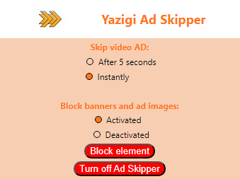

# Yazigi Ad Skipper

## Overview

Yazigi Ad Skipper is a Chrome extension designed to enhance your YouTube viewing experience by removing banners and automatically skipping video ads after a specified duration. Take control of your online content consumption with this handy tool.

## Features

- **Skip Video Ads:** Choose between skipping video ads after 5 seconds or instantly.
- **Block Banners and Ad Images:** Toggle the blocking of banners and ad images on YouTube.
- **Turn On/Off Ad Skipper:** Easily enable or disable the Ad Skipper functionality with the click of a button.

## Screenshots




## Installation

1. Download the extension files from the repository.
2. Open Google Chrome and go to `chrome://extensions/`.
3. Enable "Developer mode" in the top right.
4. Click on "Load unpacked" and select the folder containing the extension files.

## Usage

1. Click on the Yazigi Ad Skipper extension icon in the Chrome toolbar.
2. Adjust your preferences for skipping video ads and blocking banners.
3. Toggle the Ad Skipper on/off with the provided button.

## Manifest

```json
{
  "manifest_version": 3,
  "name": "YazigiAdSkipper",
  "description": "Remove all YouTube ad banners and automatically skip ads after 5 seconds.",
  "version": "1.0.0",
  "icons": {
    "16": "icon_16.png",
    "48": "icon_48.png",
    "128": "icon_128.png"
  },
  "permissions": [
    "scripting",
    "tabs",
    "activeTab",
    "storage"
  ],
  "action": {
    "default_popup": "popup.html"
  },
  "content_scripts": [{
    "run_at": "document_start",
    "matches": ["*://*.youtube.com/*"],
    "js": ["script.js"]
  }]
}
